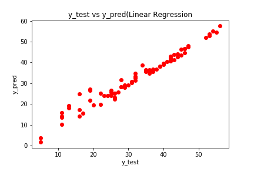
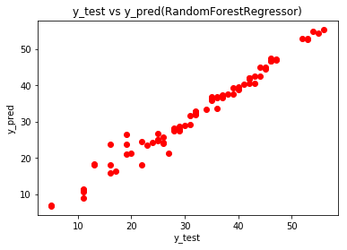
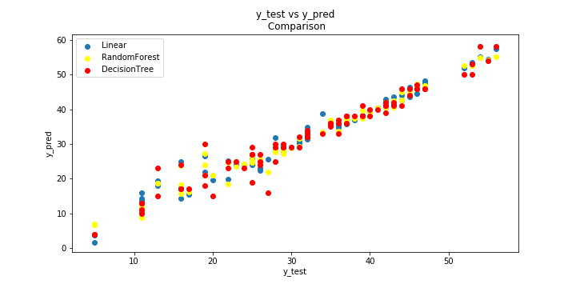

# Spectrum Internship
## Data Science and Machine Learning Project 
## Final Report

##### About the Internship
This online summer internship was conducted by Spectrum Club, College Of Engineering and Technology, Bhubaneswar for a period of 1 month in May ending on 31st May,2020.
The whole internship was divided into 3 tasks and one pretask concluding with a Student Grade Prediction model.

##### About the Project:
In this internship, I have built a Student Grade Prediction Model based on various machine learning techniques on the student's grade dataset given by the organiser.

##### Technologies used:
 
	#Language used:
		Python 3.7
	#Libraries used:
		numpy
		pandas
		sklearn
		statsmodel.api
		matplotlib.pyplot
		seaborn
	#Tools used:
		Spyder
		github

##### Project Highlights:

###### Task-1:
For the first task, numpy and matplotlib libraries were used which concluded on 8th,May,2020. This task was meant to get us familiar with the numpy and matplotlib libraries.

###### Task-2 and Final_Task:
Both task-2 and the final-task used the student-math dataset given by the organisers and I continued the work done in task-2 in the final-task. The final task concluded with the final project i.e. Student Grade Prediction Model

###### Main tasks done:
I added a column called "final_grade" to the dataset which is the summation of the three columns named "G1","G2","G3" which depicted the marks of the students.
Then, the data was preprocessed using sklearn.preprocessing library to encode the categorical valued attributes in the dataset.
	
On the encoded and modified dataset linear regression model was applied, trained and then fitted. The predicted values were plotted along with the actual test values in a scatter plot and the accuracy scores were calculated.
	
To further optimize the model and make the predictions more accurate the backward elimination method was applied on an OLS(Ordinary Least Squares) regressor model using the statsmodel.api and then the final summary was recorded.
	
Atlast, I used three different regression models namely, Linear Regression model, RandomForest Regression model and Decision Tree Regression model on the same dataset and the results were compared and plotted. 

##### Results:
**1. Linear regression model:**
```
Accuracy Scores:
	Train score: 0.9759271752511826
	Test score: 0.9615725887131311
	Predict score: 1.0
```	
**Plot:**


	
**2. RandomForestRegressor model:**

Accuracy scores:
	Train score: 0.9959036080691345
	Test score: 0.9716934923691417
	Predict score: 1.0

Plot:

	
	
3. DecisionTreeRegressor model:

Accuracy scores:
	Train score: 1.0
	Test score: 0.9455756658990981
	Predict score: 1.0

Plot:

	
# Comparison between the three models:



# Future Development:
1. A web-application can be developed to predict students grades.
2. A database can be included.
3. Can be applied on the students data on city-wise, district-wise and other higher levels.
4. Track the average results so as to help and guide those in need.
	
	
Submitted By:
Bibhusmita Patro

	

	
	


	
 

